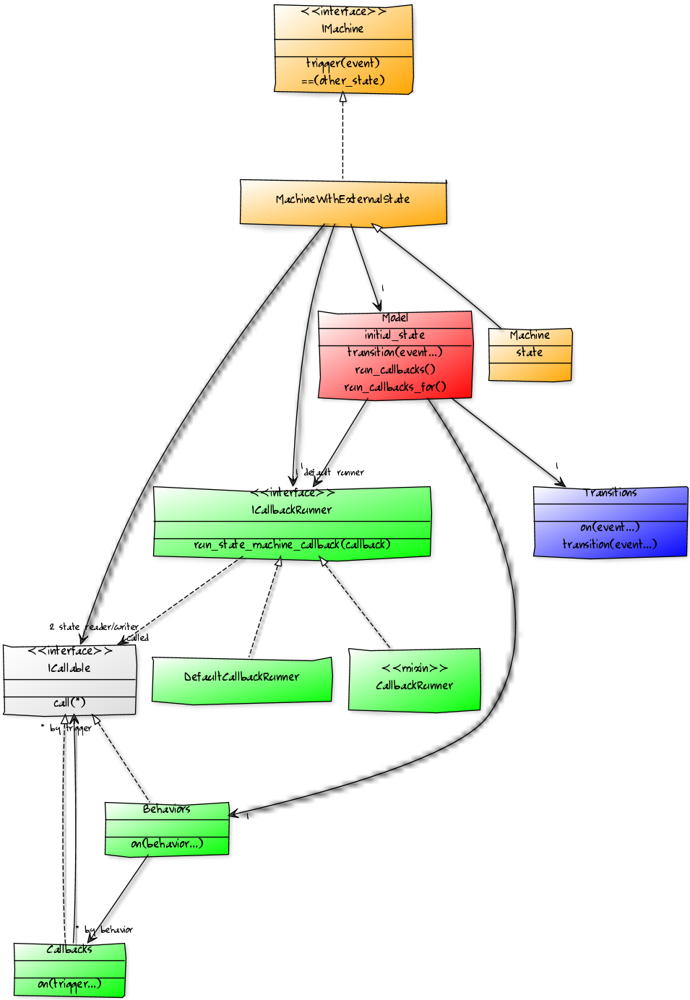

# composable\_state_machine

[](http://travis-ci.org/swoop-inc/composable_state_machine?branch=master) [](https://gemnasium.com/swoop-inc/composable_state_machine) [](https://codeclimate.com/repos/526dee6b13d63752bd00675f/feed)

Would you like lots of DSL sugar with a bloated state machine implementation that can only be used with ActiveRecord? If so, this is not the gem for you. If you are looking for a simple, flexible and easy to use, extend & debug state machine implementation then look no further.

Here are a dozen reasons to give composable\_state_machine a try:

1. Have as many state machines per object as you need.
1. Use whichever field/attribute/variable you want to store the machine's state.
1. State machine transitions are pure data. You can store them in the database or throw them on the wire.
1. Use almost any object to denote a state, including `nil` (sometimes great for the initial state).
1. Use almost any object to denote an event.
1. Pass optional parameters with events for powerful behaviors.
1. Mix state transition specifications and behaviors (callbacks) independently to quickly create state machine variations.
1. Share an immutable state machine model with any number of machine instances.
1. Add entirely new types of behaviors in less than 10 lines of code.
1. Use Procs, blocks, bound or unbound methods for callbacks.
1. Easily decorate callbacks for debugging, logging, caching or any other reason.
1. There are no runtime dependencies so you can use this gem anywhere.

composable\_state\_machine is a horrible but descriptive name. The simplicity and flexibility of the state machine comes from the composition-based implementation, which pays careful attention to [SOLID](http://en.wikipedia.org/wiki/SOLID_(object-oriented_design)). Most classes are under 20 LOC and there is 100% test coverage. If you don't like something, chances are that you can change the behavior by writing a few lines in your own namespace, without needing to fork.


## Installation

Add this line to your application's Gemfile:

```ruby
gem 'composable_state_machine'
```

And then execute:

```bash
$ bundle
```

Or install it yourself as:

```bash
$ gem install composable_state_machine
```


## Usage & examples

There are many examples in the tests, especially in `spec/integration`. Another easy way to explore is to run `rake console`. This will start an IRB session with the gem preloaded. That's how all the examples below were generated.

Before we begin, here is the big picture (skip ahead if you want the [actual picture](#design--implementation)):

- A state [Machine](https://github.com/swoop-inc/composable_state_machine/blob/master/lib/composable_state_machine/machine.rb) maintains its own state.
- A machine's behavior is controlled by its [Model](https://github.com/swoop-inc/composable_state_machine/blob/master/lib/composable_state_machine/model.rb), which specifies:
    - The valid [Transitions](https://github.com/swoop-inc/composable_state_machine/blob/master/lib/composable_state_machine/transitions.rb) in the state machine.
    - The [Behaviors](https://github.com/swoop-inc/composable_state_machine/blob/master/lib/composable_state_machine/behaviors.rb) exhibited during operation.
    - The default initial state.
- For every type of behavior, a model can include [Callbacks](https://github.com/swoop-inc/composable_state_machine/blob/master/lib/composable_state_machine/callbacks.rb).
- Which callback is executed depends on the state the machine is in.
- Callbacks are executed in the right context for each machine instance by a [CallbackRunner](https://github.com/swoop-inc/composable_state_machine/blob/master/lib/composable_state_machine/callback_runner.rb).
- Models have a [DefaultCallbackRunner](https://github.com/swoop-inc/composable_state_machine/blob/master/lib/composable_state_machine/default_callback_runner.rb).

That's all you need to know to do some pretty cool things with this gem.

### Simple state machine with no behaviors

```ruby
hiring_model = ComposableStateMachine.model(transitions: {
    :hire => {:candidate => :hired, :departed => :hired, :fired => :hired},
    :leave => {:hired => :departed},
    :fire => {:hired => :fired}
})
bob = ComposableStateMachine.machine(hiring_model, state: :candidate)
bob.state
 => :candidate
bob.trigger(:hire)
 => :hired
bob.state
 => :hired
bob == :hired
 => true
bob.trigger(:hire) # no state transition
 => nil
bob.state
 => :hired
```

### External state management

This example shows how you can choose where to store the state of a machine. It's also a great example of processing state change notifications. The power here comes from [MachineWithExternalState](https://github.com/swoop-inc/composable_state_machine/blob/master/lib/composable_state_machine/machine_with_external_state.rb) which takes two procs/methods, one for reading the state and the other for updating the state.

```ruby
class Room
  MACHINE_MODEL = ComposableStateMachine.model(
      transitions: {
          heat: {cold: :warm, warm: :hot},
          cool: {warm: :cold, hot: :warm},
      }
  )

  attr_reader :temp

  def initialize(temp)
    @machine = ComposableStateMachine::MachineWithExternalState.new(
        MACHINE_MODEL, method(:temp), method(:temp=), state: temp)
  end

  def heat(periods = 1)
    periods.times { @machine.trigger(:heat) }
    self
  end

  def cool(periods = 1)
    periods.times { @machine.trigger(:cool) }
    self
  end

  private

  def temp=(new_value)
    puts " -- Temperature changed from #{temp.inspect} to #{new_value.inspect}"
    @temp = new_value
  end
end

Room.new(:cold).heat(5).cool.temp
 -- Temperature changed from nil to :cold
 -- Temperature changed from :cold to :warm
 -- Temperature changed from :warm to :hot
 -- Temperature changed from :hot to :warm
 => :warm
```

### Callbacks

By default, the only type of callback in the current implementation is on entering a state. This is easy to change as you will see in the next example but has not been a limitation in the use cases we have encountered so far.

The `:enter` behavior uses states as the triggers for callbacks. You can specify any number of callbacks for the same state.

There is a special state called `:any`. Callbacks registered for the :any trigger will run every single time their behavior is activated. This makes them great for logging, debugging, implementing an observer pattern, etc.

Callbacks here are more powerful than in other state machine implementations we have encountered. They receive the original state, the event causing the transition and the state the machine is transitioning to. In addition, events can be triggered with any number of optional arguments, which are passed to callbacks.

Callbacks are executed by callback runners. The default callback runner, the unsurprisingly named DefaultCallbackRunner, simply calls a callback's `call` method, which will use the value of `self` from the binding where the callback was defined. If you want to define your state machine models once and then use them across object instances, which is a really good idea, then you need the callbacks to use the object instance as `self`. To do this, mix in CallbackRunner and pass the object instance as the callback runner, as shown in this example.

```ruby
class Person
  include ComposableStateMachine::CallbackRunner

  MACHINE_MODEL = ComposableStateMachine.model(
      transitions: {
          hire: {candidate: :hired, departed: :hired, fired: :hired},
          leave: {hired: :departed},
          fire: {hired: :fired},
      },
      behaviors: {
          enter: {
              hired: proc { puts "Welcome, #{@name}!" },
              fired: [
                  proc { puts "  Gee, #{@name}!" },
                  proc { puts "  You got a raw deal, #{@name}..." },
              ],
              any: proc { |current_state, event, new_state|
                puts "  Going from #{current_state.inspect} to #{new_state.inspect} " \
                     " due to a #{event.inspect} event"
              }
          }
      }
  )

  def initialize(name, state)
    @name = name
    @machine = ComposableStateMachine.machine(
        MACHINE_MODEL, state: state, callback_runner: self)
  end

  def hire!
    @machine.trigger(:hire)
    self
  end

  def fire!
    @machine.trigger(:fire)
    self
  end
end

Person.new('Bob', :candidate).hire!.fire!
  Welcome, Bob!
  Going from :candidate to :hired due to a :hire event
  Gee, Bob!
  You got a raw deal, Bob...
  Going from :hired to :fired due to a :fire event
```

### Adding new state machine behaviors

What if you needed callbacks fired upon leaving a state? Let's see if composable\_state_machine lives up to its claim that adding these types of behaviors can be done in a few lines of code without forking the gem.

```ruby
class ModelWithLeaveCallbacks < ComposableStateMachine::Model
  def run_callbacks(callback_runner, current_state, event, new_state, arguments)
    run_callbacks_for(callback_runner, :leave, current_state,
                      current_state, event, new_state, *arguments)
    super
  end
end

class Person
  include ComposableStateMachine::CallbackRunner

  MACHINE_MODEL = ComposableStateMachine.model(
      transitions: {
          hire: {candidate: :hired, departed: :hired, fired: :hired},
          leave: {hired: :departed},
          fire: {hired: :fired},
      },
      behaviors: {
          enter: {
              hired: proc { puts "  Welcome, #{@name}!" },
              fired: proc { puts "  Gee, #{@name}..." },
          },
          leave: {
              fired: proc { puts '  Is this a good idea?' }
          }
      },
      model_factory: ModelWithLeaveCallbacks
  )

  def initialize(name, state)
    @name = name
    @machine = ComposableStateMachine.machine(
        MACHINE_MODEL, state: state, callback_runner: self)
  end

  def hire!
    @machine.trigger(:hire)
    self
  end

  def fire!
    @machine.trigger(:fire)
    self
  end
end

Person.new('Bob', :candidate).hire!.fire!.hire!
  Welcome, Bob!
  Gee, Bob...
  Is this a good idea?
  Welcome, Bob!
```

It took us 7 lines of code to extend the behavior of the default Model and one line of code to tell the convenience method `ComposableStateMachine.model` to use our model class as the factory to build models from. Pretty neat. Adding callbacks based on events would only take one extra call to `run_callbacks_for`: just two extra lines. Hopefully, you are starting to get a sense of the power that comes through good use of composition patterns.

### Transitions

If you want more control over building the transitions for a state machine model you can do it in code.

```ruby
transitions = ComposableStateMachine::Transitions.new.
      on(:hire, candidate: :hired, departed: :hired).
      on(:hire, fired: :hired).
      on(:leave, hired: :departed).
      on(:fire, hired: :fired)
transitions.events.sort
 => [:fire, :hire, :leave]
transitions.states.sort
 => [:candidate, :departed, :fired, :hired]
```

### Behaviors & callbacks

By the same token, you can have finer-grained control over configuring behaviors and callbacks.

```ruby
leave_callbacks = ComposableStateMachine::Callbacks.new.
      on(:candidate, proc { puts 'You will love it here!' }).
      on(:hired, proc { puts 'Sorry to see you go.' })
custom_callback_manager = lambda { |runner, trigger, *args|
    callback = choose_callback(trigger)
    runner.run_state_machine_callback(callback, *args)
}
behaviors = ComposableStateMachine::Behaviors.new.
      on(:enter, {hired: proc { puts 'Welcome!' }}).
      on(:leave, leave_callbacks).
      on(:event, custom_callback_manager)
```

## Design & implementation

The following picture is a decent approximation of what's going on under the covers, courtesy of [yUML](http://yuml.me), which may be helpful in using and extending the gem. Here are a few pointers:

- Because we are using Ruby there are no real interfaces. Think duck-typing.
- Classes in blue relate to the definition of states and the transitions between them through events.
- Classes in green relate to behaviors and callbacks.
- Classes in red are about state machine models.
- Classes in orange are about state machine instances.



The yUML source for the diagram is [here](assets/class-diagram.yuml).


## Contributing

1. Fork the repo
2. Create a topic branch (`git checkout -b my-new-feature`)
4. Commit your changes (`git commit -am 'Add some feature'`)
5. Push to the branch (`git push origin my-new-feature`)
6. Create new Pull Request

Please don't change the version and add solid tests.


## Credits

[Michel Martens](https://github.com/soveran) for creating [micromachine](https://github.com/soveran/micromachine). composable\_state_machine came to life because extending micromachine without breaking backward compatibility turned out to be difficult.

composable\_state_machine was written by [Simeon Simeonov](https://github.com/ssimeonov) and is maintained & funded by [Swoop, Inc.](http://swoop.com)


License
-------

composable\_state_machine is Copyright © 2013 Simeon Simeonov and Swoop, Inc. It is free software, and may be redistributed under the terms specified below.

MIT License

Permission is hereby granted, free of charge, to any person obtaining
a copy of this software and associated documentation files (the
"Software"), to deal in the Software without restriction, including
without limitation the rights to use, copy, modify, merge, publish,
distribute, sublicense, and/or sell copies of the Software, and to
permit persons to whom the Software is furnished to do so, subject to
the following conditions:

The above copyright notice and this permission notice shall be
included in all copies or substantial portions of the Software.

THE SOFTWARE IS PROVIDED "AS IS", WITHOUT WARRANTY OF ANY KIND,
EXPRESS OR IMPLIED, INCLUDING BUT NOT LIMITED TO THE WARRANTIES OF
MERCHANTABILITY, FITNESS FOR A PARTICULAR PURPOSE AND
NONINFRINGEMENT. IN NO EVENT SHALL THE AUTHORS OR COPYRIGHT HOLDERS BE
LIABLE FOR ANY CLAIM, DAMAGES OR OTHER LIABILITY, WHETHER IN AN ACTION
OF CONTRACT, TORT OR OTHERWISE, ARISING FROM, OUT OF OR IN CONNECTION
WITH THE SOFTWARE OR THE USE OR OTHER DEALINGS IN THE SOFTWARE.
